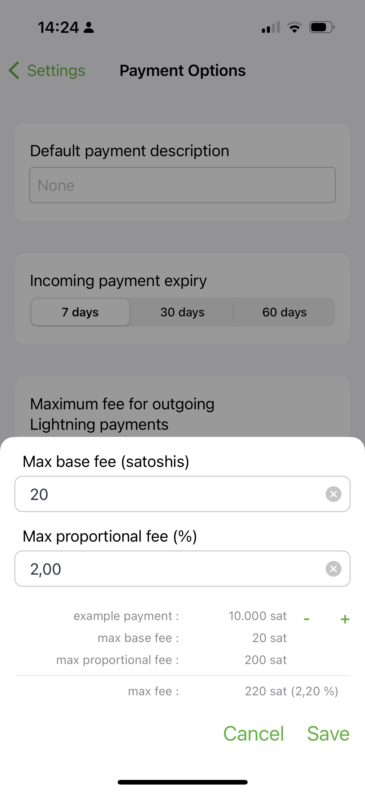
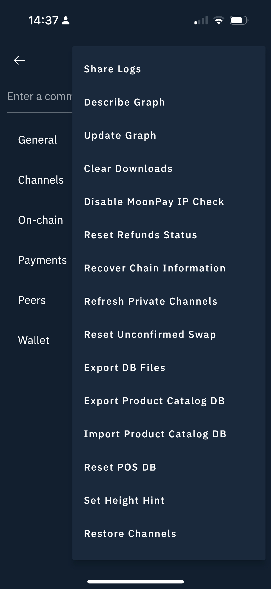
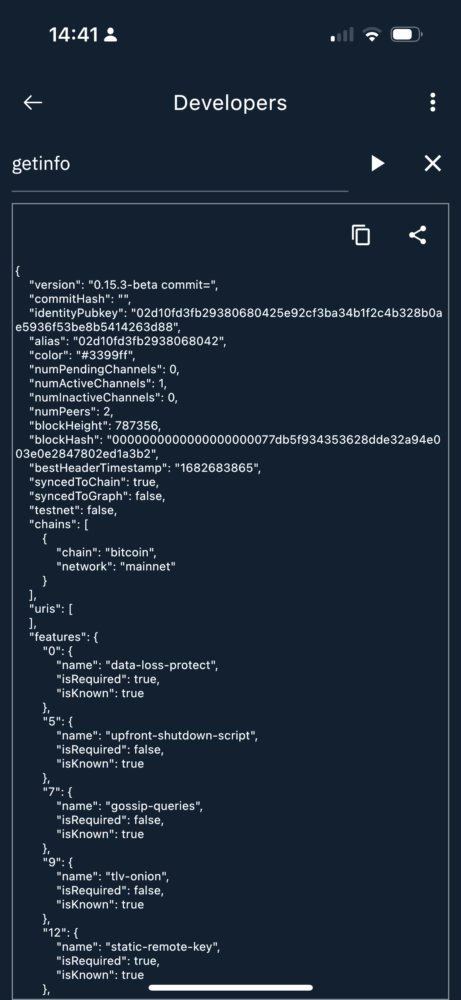
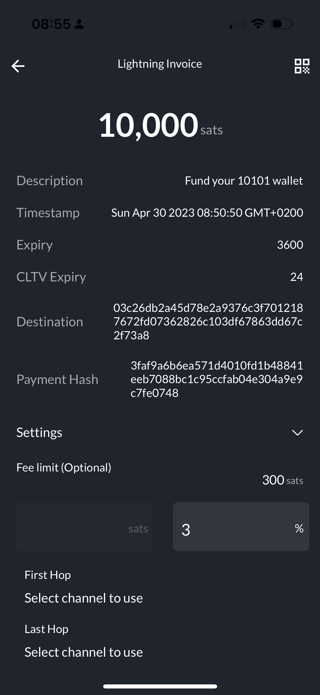

# 10101 Onboarding

Our 10101.finance routing node acts as LSP and will create a just-in-time channel with you once the first payment is received.
This channel will have a capacity of 200k sats.
Currently don't take any fees for creating that channel, but we have a fee policy of 2% and 1000 msats base fee to cover some of the costs for opening these channels.
So make sure that your fee limits cover for that.

Please also note, that we are not yet well connected to the network, so it may take a few hops before you will be able to reach us.

The following sections provide some guidance on how to fund the 10101 wallet from the different apps.

## Onboarding through a mobile app

If you want to fund 10101 through another mobile app on your phone, make sure that you have started 10101 in the background and switch back to it after sending the payment from the onboarding wallet.
The 10101.finance LSP will wait 30 seconds for the 10101 app to come back online before the payment is marked as failed.

## Onboarding through the Phoenix Wallet

You need to increase your maximum fee for outgoing Lightning payments.
Follow these steps to get you going.

1. Open your Phoenix Wallet on your phone.
2. Go To Settings / Payment options & fees
3. Click on Maximum fee for outgoing Lightning payments and set it to 20 sats + 2,00%

## Onboarding through the Breez Wallet

If you run into a `no route` error on your Breez wallet you may have to update your graph.

1. Open your Breez Wallet on your phone.
2. Hit the wallet icon on the upper left corner and open Preferences.
3. Select the Developers tab.
4. On the Developers Screen hit the 3 dots on the upper right corner and hit `Update Graph`

This will delete your graph and start the sync again after restarting the app.
You will have to keep the Breez wallet open for a couple of minutes for the graph to finish syncing.

Once you have restarted the Breez wallet you can check the status of your graph sync again on the Developers Screen.

Wait for `syncedToGraph` to change from `false` to `true`

See https://doc.breez.technology/Troubleshooting-Payment-Failures.html for more details on how to fix potential `no route` issues.

## Onboarding through the Zeus Wallet

You need to increase your fee limit when paying the lightning invoice.

1. Open your Zeus app on your phone
2. Open the Lightning wallet and hit send
3. Paste your invoice from the 10101 wallet.
4. Open the Settings tab and change the Fee limit (Optional) to 3%.

